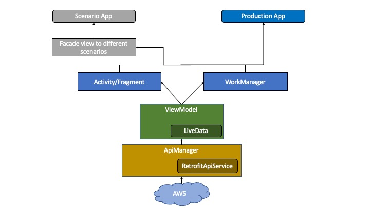
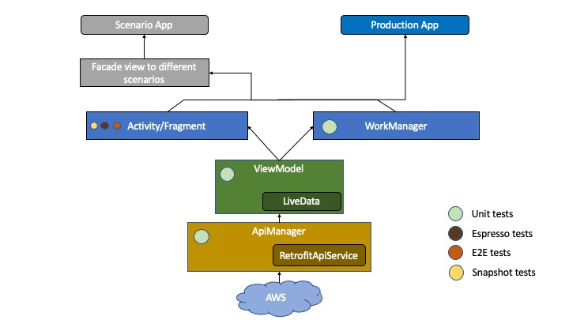

# Android app architecture
This page explains app level architecture of COVID-19 app

We produce two separate apps from this codebase.

The `Production` app is the app that is uploaded to App Store, and is always only configured for production. For example, there are no testing features, insecure logging, or internal assets.

The `Scenarios` app is used internally by developers and other members of the team. It provides additional features that are useful for testing, such as mock and non-production environments.

`Scenarios` also offer a way for the development team as well as the stakeholders a way to easily go through design and various flows.

Following diagrams explain on a high level how code is strucutured

# Testing strategy

Following diagrams summarises our testing approach about the app. It explains what various test we have and where we have put them to keep the app safe from any bugs

