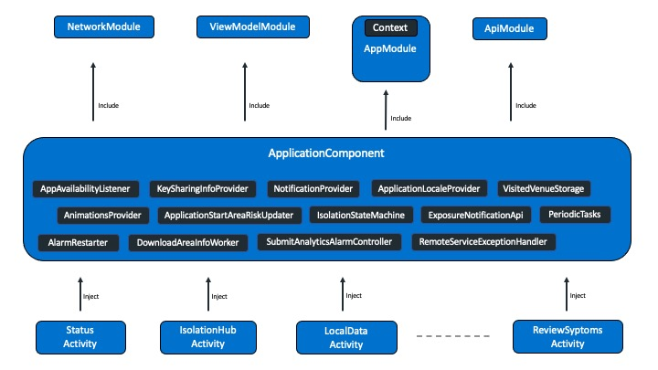

# Dependency injection using Dagger2

We are using [Dagger2](https://dagger.dev/dev-guide/android.html) as our dependency injection framework.

It has simplest implementation in this project. We have single component and all injection leaves pretty much inside it. App component has 4 modules

- [ApiModule](https://github.com/nihp-public/covid-19-app-android-ag/blob/master/app/src/main/java/uk/nhs/nhsx/covid19/android/app/di/module/ApiModule.kt)
- [NetworkModule](https://github.com/nihp-public/covid-19-app-android-ag/blob/master/app/src/main/java/uk/nhs/nhsx/covid19/android/app/di/module/NetworkModule.kt)
- [ViewModelModule](https://github.com/nihp-public/covid-19-app-android-ag/blob/master/app/src/main/java/uk/nhs/nhsx/covid19/android/app/di/module/ViewModelModule.kt)
- [AppModule](https://github.com/nihp-public/covid-19-app-android-ag/blob/master/app/src/main/java/uk/nhs/nhsx/covid19/android/app/di/module/AppModule.kt)

Then we have [ApplicationComponent](https://github.com/nihp-public/covid-19-app-android-ag/blob/master/app/src/main/java/uk/nhs/nhsx/covid19/android/app/di/ApplicationComponent.kt) which simply binds all modules togather and has series of inject function which will be implemented by Dagger at the time of buidling the app. The `ApplicationComponent` also provides instance some important classes like `AppAvailabilityListener`, `PeriodicTasks`, `ExposureNotificationRetryAlarmController`, `VisitedVenuesStorage`, `IsolationStateMachine`, `ExposureNotificationApi` etc.

Check following diagram to understand it in a better way.

